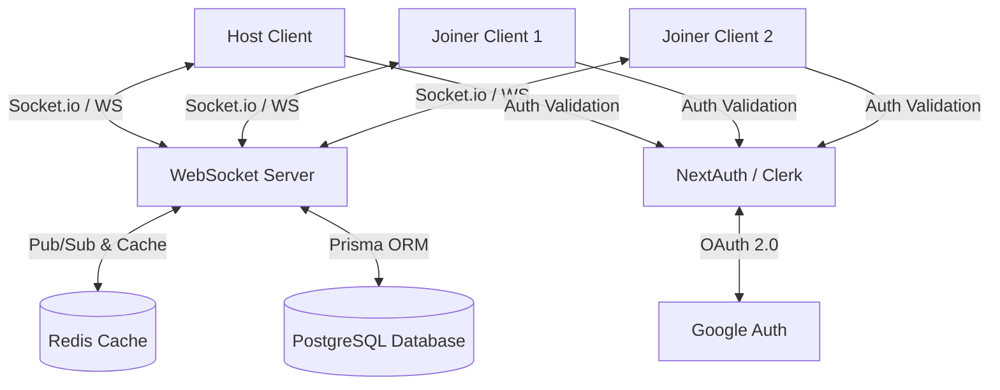

# YouTube Sync Player - High-Precision Synchronization System
## Architectural Blueprint & Detailed Implementation Plan

This document outlines the architecture, data models, real-time synchronization algorithm, and tech stack for a full-fledged, professional-grade **YouTube Sync Player**.

---

## 1. System Architecture Overview



### Tech Stack Details
1. **Frontend**: Next.js 14/15 (React 19, App Router) + TailwindCSS + shadcn/ui.
2. **Real-Time Layer**: Node.js + Socket.io.
   - *Why?* Socket.io provides automatic fallback to long-polling, packet buffering, reconnection handling, and room multiplexing out-of-the-box.
3. **Database**: PostgreSQL (Prisma ORM) for persistent data (User, Room history).
4. **Caching & State Management**: Redis.
   - Active room states are held in Redis with sub-millisecond fetch times.
   - Redis Pub/Sub enables horizontal scaling of WebSocket servers (multiple Node instances can share room updates).
5. **Video Playback**: YouTube IFrame Player API.
   - Direct implementation wrapper or utilizing custom controls around standard HTML5/Iframe elements.

---

## 2. The "Zero-Delay" High-Precision Sync Algorithm

To achieve sub-millisecond sync across multiple devices across the internet, the system implements a **multi-tiered synchronization engine** modeled after NTP (Network Time Protocol) and professional broadcast playout sync.

### Step 2.1: NTP-Style Clock Synchronization (Estimating Network Latency & Offset)
Every client's local clock has a slight drift relative to the server and other clients. We must first establish a **Common Logical Server Time ($T_{\text{server}}$)** for each client.

1. The client sends a sync request containing client timestamp $T_1$.
2. The server receives the request at $T_2$, and sends a response back at $T_3$ with both $T_2$ and $T_3$.
3. The client receives the response at client timestamp $T_4$.

```
Client                 Server
  |-- T1 (Send Request) -->|
  |                        |-- T2 (Receive Request)
  |                        |-- T3 (Send Response)
  |<-- T4 (Recv Response) -|
```

We compute:
*   **Round-Trip Time (RTT)**:
    $$\text{RTT} = (T_4 - T_1) - (T_3 - T_2)$$
*   **Clock Offset ($\theta$)**:
    $$\theta = \frac{(T_2 - T_1) + (T_3 - T_4)}{2}$$

The **Actual Server Time** at any client local time $t_{\text{local}}$ is:
$$T_{\text{server}}(t_{\text{local}}) = t_{\text{local}} + \theta$$

*Implementation Note: This ping-pong exchange is performed 5 times upon initial connection. We discard outliers (highest RTT) and take the average offset of the remaining samples. It runs as a lightweight background tick every 30 seconds to adjust for clock drift.*

---

### Step 2.2: Absolute Timeline Sync Model
The state of any active stream/room is stored in Redis under key `room:<roomId>:state` with the following schema:
```json
{
  "videoId": "dQw4w9WgXcQ",
  "status": "PLAYING", 
  "videoProgress": 42.125, // In seconds
  "serverTimeUpdatedAt": 1782381239102 // Absolute server timestamp (Epoch ms)
}
```

When a **Joiner** plays the stream, they calculate the **Expected Playback Position ($P_{\text{expected}}$)**:
1. If `status === "PAUSED"`:
   $$P_{\text{expected}} = \text{videoProgress}$$
2. If `status === "PLAYING"`:
   $$\Delta t = T_{\text{server}}(t_{\text{local}}) - \text{serverTimeUpdatedAt}$$
   $$P_{\text{expected}} = \text{videoProgress} + \left( \frac{\Delta t}{1000} \right)$$

---

### Step 2.3: Playback Rate Correction (Anti-Stutter Sync)
Instead of aggressively seeking (which causes audio pops and visual stutters), the Joiner Client uses a **Proportional-Integral (PI) Controller** or a tiered correction strategy based on the current Drift ($\delta = P_{\text{expected}} - P_{\text{actual}}$):

| Drift Scope | Action Taken | Rationale |
| :--- | :--- | :--- |
| **$\delta < 50\text{ms}$** | **Do Nothing** | Within human perception tolerance; preserves audio flow. |
| **$50\text{ms} \le \delta < 1.5\text{s}$** | **Adjust Playback Rate** | If behind ($\delta > 0$), set `playbackRate = 1.05`. <br>If ahead ($\delta < 0$), set `playbackRate = 0.95`. <br>Once drift falls below $20\text{ms}$, reset `playbackRate = 1.0`. |
| **$\delta \ge 1.5\text{s}$** | **Hard Seek** | Large discrepancy (e.g. host skipped a large chunk). Perform an instantaneous seek to $P_{\text{expected}}$. |

---

## 3. Host Page: Complete YouTube-Like Interface

The Host Page doesn't just play videos; it functions as a highly interactive dashboard:
*   **Global YouTube Search**: Powered by the YouTube Data API v3 (with server-side caching). It features infinite scroll and autocomplete.
*   **Instant Playback Trigger**: Clicking any video loads it instantly into the local host player and updates the WebSocket state.
*   **Host Control Console**: 
    - Auto-seek / manual timeline slider.
    - Media session control integration (allows spacebar, media keys to control stream).
    - Sync Master Toggle: Option to pause sync momentarily to buffer or prepare next track.
    - Live Connected Watchers Count.
*   **Streaming Room Creator**: Automatically generates a short, secure, shareable join URL (e.g., `https://syncplay.app/join/abc-defg-hij`).

---

## 4. Joiner Page: Strict Passive Client Interface

The Joiner Page features a stripped-down, focused, passive receiver interface:
*   **One-Way Streaming Player**: 
    - Play/Pause/Seek controls on the YouTube player iframe are completely overlayed with a transparent, pointer-events-none layer to prevent any user tampering or play interruptions.
    - Full keyboard listener block (no spacebar play/pause).
*   **Dedicated Audio HUD**: 
    - Pure volume slider (up/down).
    - Mute/Unmute buttons.
*   **Real-time Clock Synchronizer Badge**: Shows latency metrics (RTT, clock jitter) and a status light:
    - 🟢 Sync is active and accurate within $< 30\text{ms}$.
    - 🟡 Catching up (adjusting playback speed to align).
    - 🔴 Re-synchronizing stream.

---

## 5. Database Schema & Data Models

We use PostgreSQL to persist user profiles, session logs, and room analytics.

```prisma
datasource db {
  provider = "postgresql"
  url      = env("DATABASE_URL")
}

generator client {
  provider = "prisma-client-js"
}

model User {
  id            String    @id @default(uuid())
  name          String?
  email         String    @unique
  image         String?
  createdAt     DateTime  @default(now())
  roomsHosted   Room[]    @relation("HostedRooms")
  sessionsJoined SessionParticipant[]
}

model Room {
  id          String    @id @default(cuid()) // Secure, short, readable ID
  hostId      String
  host        User      @relation("HostedRooms", fields: [hostId], references: [id], onDelete: Cascade)
  createdAt   DateTime  @default(now())
  isActive    Boolean   @default(true)
  title       String?
  currentVideoId String?
  participants SessionParticipant[]
}

model SessionParticipant {
  id        String   @id @default(uuid())
  roomId    String
  room      Room     @relation(fields: [roomId], references: [id], onDelete: Cascade)
  userId    String
  user      User     @relation(fields: [userId], references: [id], onDelete: Cascade)
  joinedAt  DateTime @default(now())
  lastPing  DateTime @default(now())
}
```

---

## 6. Implementation Roadmap

### Phase 1: Authentication & Layout Scaffolding
*   Configure Next.js project with Tailwind CSS, TypeScript, and shadcn/ui.
*   Setup Clerk/NextAuth for Google Sign-In.
*   Develop beautiful modern Landing, Host, and Join pages.

### Phase 2: Live Room WebSockets & Redis Engine
*   Build a standalone Node.js Express/Socket.io server.
*   Configure Redis cluster connection.
*   Develop `room:join`, `room:sync-state`, and `room:clock-ping` socket handlers.

### Phase 3: High-Precision Sync Integration
*   Write client-side `NTPClockSync` utility to determine clock offset.
*   Build custom YouTube Iframe Player wrapper incorporating the Playback Rate Adjuster (PI Controller) and Hard-Seek trigger.
*   Apply transparent overlay to Joiner IFrame.

### Phase 4: YouTube Search API & Advanced UI
*   Create YouTube search input proxy in backend (to hide API keys and handle rate limits).
*   Create rich Host dashboard with video queue, active viewer list, and room metrics.
